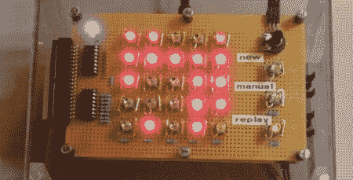

# 过度设计熄灯游戏

> 原文：<https://hackaday.com/2011/10/16/over-engineering-a-game-of-lights-out/>

[Bertho]这次可能超越了自己。他为 7400 逻辑竞赛制作了一个[熄灯克隆](http://www.vagrearg.org/?p=lightsout)。

熄灯是老虎在 90 年代中期出售的电子玩具。这个游戏的目标是关闭一个 5x 5 的发光按钮网格。不过，有一个问题——按下一个按钮会切换周围四个按钮的状态。看看这个忠实于原作的 Flash 游戏。

【Bertho】看了几页[熄灯风扇页](http://www.jaapsch.net/puzzles/lights.htm#desc)就着手设计电路。大部分构建由移位寄存器组成:“游戏状态”保存在五个 74hc164 移位寄存器和一个 4557 可编程寄存器中。棋盘上有一个随机数发生器，它会切换游戏寄存器中的位，直到找到一个可解的谜题。一座真正壮观的建筑。

对于发光按钮本身，[Bertho]找到了一个[老黑客一天贴](http://hackaday.com/2009/01/29/led-push-buttons/)描述了将轻触开关放在 LED 下面。经过 [15 个小时的焊接](http://www.vagrearg.org/?p=lightsout2)，这个项目被放进了一个漂亮的有机玻璃围栏里。[Bertho]好心地上传了一段比赛的视频。休息之后来看看。

 <https://www.youtube.com/embed/4Bb0QfZ2GNw?version=3&rel=1&showsearch=0&showinfo=1&iv_load_policy=1&fs=1&hl=en-US&autohide=2&wmode=transparent>

 </body> </html>