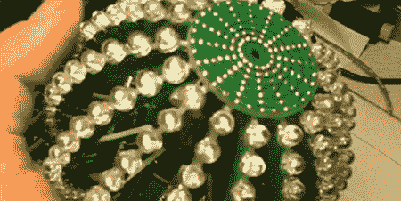

# 我们想要这个 LED 球

> 原文：<https://hackaday.com/2011/10/16/we-want-this-led-ball/>

[Nikolai]有个朋友喜欢火和灯光表演。她的生日快到了，所以[尼古拉]决定做点什么来赞美她的表演。他发明了一个 10 厘米长的 LED 球(俄语，谷歌[翻译](http://translate.google.com/translate?sl=ru&tl=en&js=n&prev=_t&hl=en&ie=UTF-8&layout=2&eotf=1&u=http%3A%2F%2Fradiokot.ru%2Fkonkurs%2F73%2F&act=url))，其表面包裹着 256 个 LED 矩阵。

球的结构支撑是它自己的 PCB。球的底部是一个简单的总线，不需要任何组件。处理器模块与边上带 led 的侧弧一起装入总线。顶部装有两节 AA 电池和一个 MAX1674 升压转换器。从内部看去,[像是某种奇异的外星设备。非常酷。](http://radiokot.ru/konkurs/73/13.jpg)

中央处理器模块基于 ATmega88。微处理器控制 16 个侧板中的每一个的两个‘595。到目前为止，已经编程了四种操作模式——一个环绕球体的正弦图、一个随机函数、两个振荡圆和普通的旧线。LED 球的代码是可用的([场外链接](http://radiokot.ru/konkurs/73/01.rar))，幸好变量是英文的。令人印象深刻的工程和电路板布局技巧。

休息后看看 LED 球的视频。

 <https://www.youtube.com/embed/7NmFXt8k5Ao?version=3&rel=1&showsearch=0&showinfo=1&iv_load_policy=1&fs=1&hl=en-US&autohide=2&wmode=transparent>

 </body> </html>