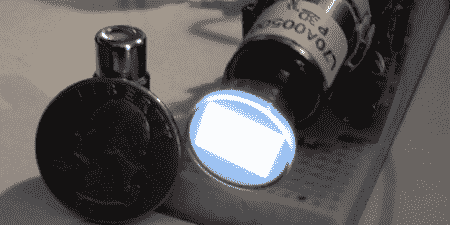

# 制作第二小的俄罗斯方块

> 原文：<https://hackaday.com/2011/10/18/building-the-second-tiniest-tetris/>

几年前，在一次 hamfest 上，[Richard]从一个垃圾箱里拖出了一个被压碎的摄像机。将半英寸 CRT 从取景器中拉出后，他需要找一个项目。[理查德]最终制作了我们见过的第二小的俄罗斯方块游戏。

在摆弄了 CRT 之后，[Richard]发现其中一个管脚可以接受 NTSC 输入。他还发现了一个类似的项目,用一个一毛钱大小的 CRT 玩俄罗斯方块。随着代码准备就绪，[Richard]开始将他的项目组装成一个漂亮的木箱。

有两个 PCB 用于构建——一个 CRT 驱动电路和一个处理游戏和控制器代码的小型定制板。游戏板的电路在[这个站点](http://www.rickard.gunee.com/projects/video/pic/gamesys.php)上找到，但是那里的特色板对于这个项目来说太大了。BatchPCB 制作了一个拆下来的板，放入盒子中。

控制台本身没有任何控制，因为安装了标准的 DB-9 连接器，所以可以使用老式的 Atari 操纵杆。为了获得更符合人体工程学的俄罗斯方块体验，可以使用世嘉 Genesis 控制器。对于一个看起来像是从蒸汽朋克实验室出来的东西来说，玩俄罗斯方块有点出乎意料。休息之后，请观看放大 20 倍的屏幕演示视频。

[https://www.youtube.com/embed/fMYwlN9wpcQ?version=3&rel=1&showsearch=0&showinfo=1&iv_load_policy=1&fs=1&hl=en-US&autohide=2&wmode=transparent](https://www.youtube.com/embed/fMYwlN9wpcQ?version=3&rel=1&showsearch=0&showinfo=1&iv_load_policy=1&fs=1&hl=en-US&autohide=2&wmode=transparent)