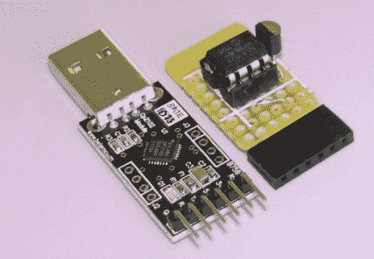

# 在几分钟内组装一个温度记录器

> 原文：<https://hackaday.com/2011/10/18/throw-together-a-temperature-logger-in-minutes/>

[Rajendra]发现了一种简单的方法来制作 USB 温度记录器。他已经有了一个 USB 转 UART 适配器来处理繁重的工作。一端有 USB 插头，另一端有一组引脚提供接地连接、3.3V 和 5V 馈电以及 RX/TX 线路。

要让硬件启动并运行，他所需要的只是读取温度传感器并将数据通过串行连接发送出去。PIC 12F1822 形式的 8 引脚微控制器实现了这一功能。它通过 USB-UART 上的 5V 引脚供电，并使用 ADC 从 MCP9701A 传感器获取温度数据。

采样率被硬编码到 PIC 的固件中，但添加一个按钮或编码一些串行监控可以很容易地使其可配置。[Rajendra]使用 Processing 编写了一个应用程序，显示输入的温度信息，并使用计算机对输入进行时间标记和记录。我们可以将此视为在发酵过程中跟踪麦芽汁温度的快速解决方案，以确保您的啤酒刚刚好。