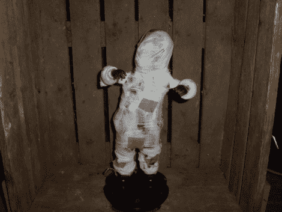

# 万圣节技巧:把那个讨厌的跳舞圣诞老人变成万圣节木乃伊！

> 原文：<https://hackaday.com/2011/10/17/halloween-hacks-transform-that-annoying-dancing-santa-into-a-halloween-mummy/>

如果你有一个令人讨厌的跳舞装饰品(圣诞老人/猫王/弗兰肯斯坦),你可以像米什卡一样改变它的用途。他原本想参加[我们的圣诞老人挑战赛](http://hackaday.com/2010/12/27/santa-pede-challenge-take-two/)，并购买了一个跳舞的圣诞老人，但时间最终战胜了他。由于没有其他用途，他决定把他的跳舞圣诞玩具做成一件有趣的万圣节装饰品。

电子版的《铃儿响叮当》并不是最可怕的，所以他拆除了跳舞玩具，开始摆弄声卡。几个放置好的电阻之后，他的电路弯曲的圣诞老人开始听起来像他喝了五杯太多的蛋奶酒，这对于跳舞的木乃伊(米什卡)来说是完美的。

他把圣诞老人底座上的一些发光二极管移植到他的头上，并用一些绝缘胶带把它遮住，这样就只能看到眼睛了。然后他用必要的带血的绷带把木乃伊包起来，让孩子们欣赏。

由于很难找到真正喜欢这些跳舞玩具的人，我们认为这是让它们再次有用的好方法。如果你有一些这样的东西，我们建议用一群圣诞老人僵尸重演《颤栗》中的舞蹈动作，并给我们发一段视频。

继续阅读，观看[米什卡的]木乃伊行动视频。

 <https://www.youtube.com/embed/uAhzeCY9xdo?version=3&rel=1&showsearch=0&showinfo=1&iv_load_policy=1&fs=1&hl=en-US&autohide=2&wmode=transparent>

 </body> </html>