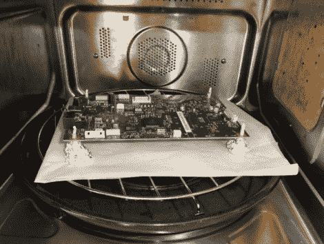

# 让 HP LaserJet 1522 系列焕发生机

> 原文：<https://hackaday.com/2011/10/19/baking-an-hp-laserjet-1522-series-back-to-life/>

他自己也有一个问题。不幸的是，他的惠普激光打印机在保修期过后不久就坏了，惠普准备向他收取 350€的维修费用。因为那几乎可以买一个新的，所以他决定试着自己解决这个问题。他在互联网上寻找解决问题的方法，幸运地发现他的打印机可能可以恢复。

整个 LaserJet M1522 系列显然很容易损坏，接口板是常见的故障点。为了修理他的打印机，他拆开了外壳，从设备上取下了接口板。一旦板载电池被移除，他就用铝箔制作了一套支架，并将电路板放在 180°C(~ 356°F)的烤箱中大约 8 分钟。

冷却后，他重新安装电路板，他的打印机表现得像新的一样。[Thice]表示，他的解决方案的唯一问题是，他需要每 6 个月左右烘烤一次电路板，这是一个很好的解决方案，但从长远来看不是最理想的解决方案。