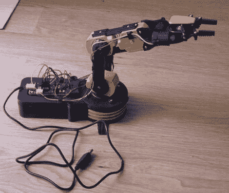

# 创造一个语音控制的机器人手臂

> 原文：<https://hackaday.com/2011/10/19/creating-a-voice-controlled-robotic-arm/>

[亚瑟]手腕受伤卧床，所以他决定这将是一个在房子周围闲逛和摆弄电子产品的好时机，因为大多数户外活动是不可能的。他拿起一个机器人手臂套件，组装起来，测试他在网上找到的一些代码。由于考虑到他的伤势，在终端上输入命令非常麻烦，他认为还不如为手臂建造一个语音控制系统。

他将他的工作分为三个部分，涵盖了从概念到完成的整个过程。[第一部分](http://www.aonsquared.co.uk/robot_arm_tutorial_1)围绕语音识别系统的词汇和语法的创建，以及如何使用语音样本训练语法模型。

他的教程的第二部分和第三部分[处理软件对他的命令的解码，以及用于将这些命令翻译成机械臂可以处理的东西的 Python 脚本。](http://www.aonsquared.co.uk/robot_arm_tutorial_3)

[Arthur 的]语音控制系统工作得很好，正如你在下面的视频中看到的，尽管他已经有了一个愿望清单，上面列满了他希望在不久的将来做出的改进。

 <https://www.youtube.com/embed/32nIxJZvqtI?version=3&rel=1&showsearch=0&showinfo=1&iv_load_policy=1&fs=1&hl=en-US&autohide=2&wmode=transparent>

 </body> </html>