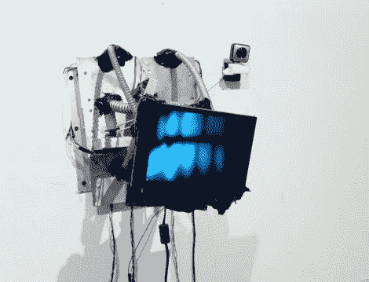

# 令人毛骨悚然的三角洲机器人跟踪你的一举一动

> 原文：<https://hackaday.com/2011/10/20/creepy-delta-bot-follows-your-every-move/>

你在上面看到的创作是艺术学生丹尼尔·伯特纳的作品，他正在芝加哥艺术学院完成他的艺术学士学位。他称[这个令人难以置信的有趣，但又有些令人不安的设备为“TIM”](http://danbertner.wordpress.com/2011/10/19/tracking-interactive-mechanism-t-i-m/)，这是追踪互动机制的缩写。

在过去一年左右的时间里，TIM 修补了不同的项目，他是一个有态度的交互式 delta bot。安装在艺术学院的沙利文画廊的墙上，蒂姆对你感兴趣，因为你在里面。当路人调查这个奇怪的装置时，它会观察他们，跟踪他们的每一个动作。

机器人的电机由 Arduino 控制，它跟踪站在附近的人的能力是通过 Open CV 处理的视频流提供的。

这真的是一个很酷的项目，我们认为它会成为一些科幻恐怖电影中的一个可怕的道具。观看下面的视频，了解 TIM 的个性表现——他不喜欢人们站得太近！

 <https://www.youtube.com/embed/-nO5cowkg4M?version=3&rel=1&showsearch=0&showinfo=1&iv_load_policy=1&fs=1&hl=en-US&autohide=2&wmode=transparent>

 </body> </html>