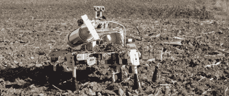

# 机器人农业意味着每个人都有更多的玉米

> 原文：<https://hackaday.com/2011/10/20/robotic-farming-means-more-corn-for-everyone/>

你知道我们都要饿死了，对吧？如果世界人口保持指数增长，而粮食产量保持线性增长，我们最终会发现 Soylent Green 是由什么组成的。这就是[大卫·多豪特]的[普洛斯彼罗机器人农夫](http://www.dorhoutrd.com/home/prospero_robot_farmer)的用武之地。[大卫]提出了使用小型自主机器人来种植、照料和收割田地的想法。现在，他正在进行第一阶段:播种。

一群六条腿的普洛斯彼罗机器人被派遣到一个领域。在那里，每一个群体成员一次种下一粒种子。机器人通过无线连接保持相互联系，以确保整个田地的最佳种植模式。

Prospero 原型是基于视差推进器，带有一个用于避开障碍物的 Ping 超声波传感器。每个六足机器人都配备了一堆种子，一个小螺旋钻，以及未来玉米作物的肥料供应。该计划的下一步是建造一个“护理”机器人，它将监测并在需要时施加养分。休息后看看普洛斯彼罗的视频。

[https://www.youtube.com/embed/CReaedEF41w?version=3&rel=1&showsearch=0&showinfo=1&iv_load_policy=1&fs=1&hl=en-US&autohide=2&wmode=transparent](https://www.youtube.com/embed/CReaedEF41w?version=3&rel=1&showsearch=0&showinfo=1&iv_load_policy=1&fs=1&hl=en-US&autohide=2&wmode=transparent)