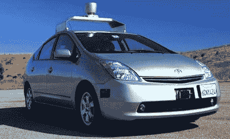

# 关于谷歌自动驾驶汽车项目的一切

> 原文：<https://hackaday.com/2011/10/23/all-about-the-google-autonomous-vehicle-project/>

已经有许多自动驾驶汽车取得了不同程度的成功，但最知名的项目可能是谷歌汽车。不过，你可能没听说过的是自动谷歌车，确切地说是高尔夫球车。[休息后的第一个视频](http://www.youtube.com/watch?v=rOWhu_aa9kM&feature=player_embedded)解释了购物车和自动驾驶汽车项目背后的动机。正如我们之前介绍过的另一辆[自动驾驶汽车](http://hackaday.com/2011/10/13/an-autonomous-minivan-for-busy-parents/)，它们没有忘记包括一个紧急停止按钮(在 1:03)！

在第二个视频(也是在广告之后)中，谷歌的巴斯蒂安·特龙和克里斯·厄姆森详细介绍了谷歌更著名的自动驾驶汽车普锐斯的工作原理，以及它们在加州不同城镇的行驶情况。在这一点上仍然使用安全驱动器，但是传感器包包括安装在车顶的 64 束激光传感器、车轮编码器、雷达和 GPS 传感器。凭借谷歌的巨大资源以及他们在街景和谷歌地图方面的工作，看看这项技术会带来什么将会很有趣。就我而言，欢迎我们的新机器人霸主。

 <https://www.youtube.com/embed/rOWhu_aa9kM?version=3&rel=1&showsearch=0&showinfo=1&iv_load_policy=1&fs=1&hl=en-US&autohide=2&wmode=transparent>

 <iframe class="youtube-player" width="800" height="480" src="https://www.youtube.com/embed/YXylqtEQ0tk?version=3&amp;rel=1&amp;showsearch=0&amp;showinfo=1&amp;iv_load_policy=1&amp;fs=1&amp;hl=en-US&amp;autohide=2&amp;wmode=transparent" allowfullscreen="true" style="border:0;" sandbox="allow-scripts allow-same-origin allow-popups allow-presentation"/> 
经由<a href="http://spectrum.ieee.org/automaton/robotics/artificial-intelligence/how-google-self-driving-car-works" target="_blank">【IEEE 频谱】</a>
 </body> </html>