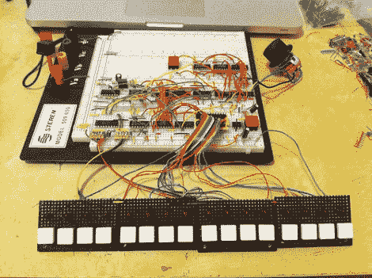

# 7400 鼓机是一种享受

> 原文：<https://hackaday.com/2011/10/22/7400-drum-machine-is-a-delight/>

[74hc595]刚刚完成了 7400 逻辑大赛的参赛作品。这是一台完全由 7400 系列逻辑芯片制成的鼓机。他还没有完全完成这个项目。硬件工作得很好，他建造了一个泡沫芯面板，比你在这里看到的有更多的控制，但大部分电路目前仍在试验板上，迄今为止只有两个通道已经完成。

休息后跳转到视频剪辑，了解该系统如何工作的细节，并听听它是如何工作的。这个演示是我们见过的合成器项目中最好的演示之一，因为他实际上讲述了每个控件的作用，以及如何用硬件来完成。我们不打算详细讨论他设计的电路。正如我们之前所说，它使用 7400 逻辑，但也来源于 555 定时器来保持节拍。上面链接的页面有一个 PDF 格式的原理图，你可能会浪费很多时间去研究他是如何做到的。我们甚至可以尝试在模拟器中构建它，看看我们能学到什么。

[https://www.youtube.com/embed/QsSKh7Z2EVs?version=3&rel=1&showsearch=0&showinfo=1&iv_load_policy=1&fs=1&hl=en-US&autohide=2&wmode=transparent](https://www.youtube.com/embed/QsSKh7Z2EVs?version=3&rel=1&showsearch=0&showinfo=1&iv_load_policy=1&fs=1&hl=en-US&autohide=2&wmode=transparent)