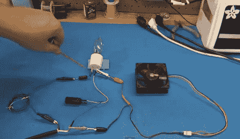

# 灯泡、二极管和电容器将电源电压降低到 12V DC

> 原文：<https://hackaday.com/2011/10/21/light-bulb-diode-and-capacitor-step-mains-down-to-12v-dc/>

[Todd Harrison]需要一种用市电电压驱动 12 伏电脑风扇的方法。嗯，我们认为他真的只是需要一些东西让他在周日有事可做，但这不是重点。他向我们展示了他是如何以一种非传统的方式做到这一点的，通过使用一个白炽灯泡的电阻负载、一个二极管和一个电容器将电压转换成他需要的电压。你可以阅读他的文章，或者在休息后观看他解释电路的 35 分钟视频。

这里的概念相当简单。二极管通过阻止交流电的负波谷进入他的电路，起到半波整流器的作用。电流的正峰值通过灯泡，将电压降低到可用水平。最后，电容器填补了交流电的负电流，为风扇提供直流电。这很容易理解，但我们需要一些数学上的帮助来计算正确的灯泡，以获得我们想要的输出电流。

 <https://www.youtube.com/embed/4OnHWZ-gL7Q?version=3&rel=1&showsearch=0&showinfo=1&iv_load_policy=1&fs=1&hl=en-US&autohide=2&wmode=transparent>

 </body> </html>