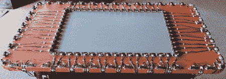

# 美杜莎:邻近感知桌面

> 原文：<https://hackaday.com/2011/10/23/medusa-a-proximity-aware-tabletop/>

最后，[米歇尔·安妮特]可以谈谈她在欧特克研究院做的超级秘密项目。

美杜莎，正如[米歇尔]的项目所称，是一个安装了 138 个接近传感器的微软 Surface。这使得该表面能够感知用户走向它，并检测用户在桌面上方的手和手臂。可以同时检测多个用户，两个用户的左右手可以映射到特定用户。

[Michelle]使用的接近传感器并不昂贵，所以我们想知道什么时候有一个疯狂的多点触摸设置的人会在他们的产品中添加接近传感器。我们想玩美杜莎，即使只是一个卡坦半岛定居者的虚拟游戏。这似乎是完美的设置…

[米歇尔]去年一月在 Autodesk 实习时建造了美杜莎。现在 [UIST 2011](http://www.acm.org/uist/uist2011/) 结束了，她终于可以说说了。还有一个视频演示了美杜莎的各种可能性，休息后看看吧。

谢谢[弗雷泽]送来这个。

 <https://www.youtube.com/embed/rjbKmyxCuEw?version=3&rel=1&showsearch=0&showinfo=1&iv_load_policy=1&fs=1&hl=en-US&autohide=2&wmode=transparent>

 </body> </html>