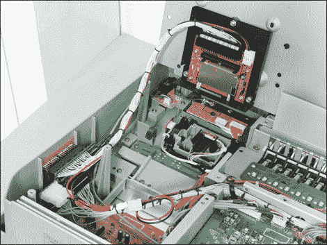

# 向 Korg Triton 添加紧凑型闪存读卡器

> 原文：<https://hackaday.com/2011/10/23/adding-a-compact-flash-reader-to-a-korg-triton/>

[Roberto Barrios]有一个他非常喜欢的 Korg Triton 采样键盘，但他已经厌倦了使用过去的媒体来存储他的工作。他可以选择软盘或 Jazz 驱动器，有一段时间他使用软盘转 USB 仿真器，但使用这种方法时键盘仍然坚持 1.44 Mb 的存储限制。他决定[打开机箱，装上自己的 CF 阅读器](http://www.rbarrios.com/projects/TRITONCF/)。

应该注意的是，这种攻击可以通过使用键盘背面的 25 针连接器来避免。他不想有外部硬件，如果你在开玩笑，这是可以理解的——这只是需要跟踪更多的设备。他的解决方案使用软盘驱动器开口来安装读卡器。他的电路是用一根带状电缆连接的。他切掉一端，将每根电线焊接到主板上的触点上。得益于 SCSI-IDE 适配器，Korg 固件将读卡器视为 SCSI 驱动器，因此存储限制非常恰当地基于所用 CF 卡的大小。

看看电缆管理。你会认为它是像这样直接从工厂来的！