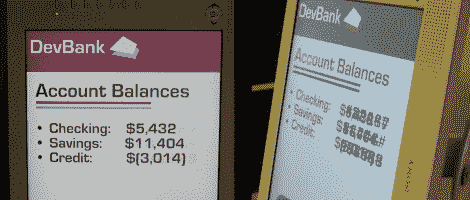

# 利用液晶显示器视角差的优势

> 原文：<https://hackaday.com/2011/10/24/using-an-lcds-poor-viewing-angle-to-your-advantage/>

早期的液晶显示器在不直接从屏幕前观看时有一些非常糟糕的问题。这些天来，这项技术已经真正减少了这个缺陷，但如果你手头还有一个便宜的显示器，你可能想把它拿出来，给这个黑客一个尝试。[Chris Harrison]正在使用倾斜视角显示廉价显示器的附加信息。

看看上面的两张图片。左边的是从显示器正前方拍的，看起来很正常。但是如果你从侧面看同一个屏幕，财务信息就模糊了。这是故意的。使用非常浅的颜色，模糊的字符从正前方几乎看不出来，但是你可以稍微看到它们(它们看起来像 CRT 屏幕上的烧屏)。但从侧面看，这些浅色变得相当醒目，与屏幕上的其他数据融为一体。

这是因为 LCD 屏幕上的偏振滤光器。如果你不熟悉的话，你可能想看[Bill Hammack] [解释 LCD 是如何工作的](http://hackaday.com/2011/03/17/bill-hammack-explains-how-led-backlit-lcd-monitors-work/)。因为视角颜色变化是一个缺陷，而不是一个功能，所以制造商将上下角度作为横向观看中最难改善的角度。[Chris 的]实验通过在其侧面使用计算机显示器来实现这一点。休息之后，请观看视频，了解他将它用于哪些不同的应用。

 <https://www.youtube.com/embed/U3g40GCluwU?version=3&rel=1&showsearch=0&showinfo=1&iv_load_policy=1&fs=1&hl=en-US&autohide=2&wmode=transparent>

 </body> </html>