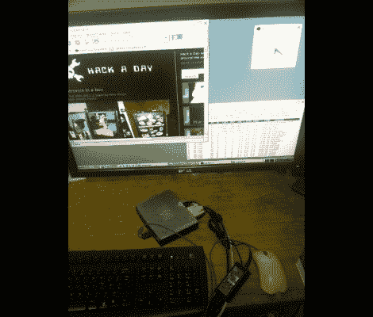

# 让瘦客户机运行 Debian 桌面

> 原文：<https://hackaday.com/2011/10/24/fattening-a-thin-client-to-run-a-debian-desktop/>

在观察瘦客户机启动时，[Nav]注意到它使用了某种类型的 Linux 内核。他想知道是否有可能在设备上运行全面的桌面分发。稍微逛了逛，他得到了一个运行在瘦客户机上的 Debian 桌面发行版。

他正在使用的硬件是惠普 t5325。它应该是一个哑客户端，连接到后端机器，如 Windows 终端服务器或通过 SSH。但它有 1.2 GHz 的 ARM 处理器，初步调查显示它运行的是 ARM 的 Debian 版本。他在引导过程中使用 CTRL-C 来破坏这个过程，并把它转储到 shell 中。登录很容易猜到，因为用户名和密码都是“root”。

一旦他获得了 root 权限，就到了大刀阔斧的时候了。他摆脱了惠普特有的设置，为 apt 系统等额外的 Debian 模块让路。这不是小事，但是他已经解决了一系列的难点，这使得整个过程变得更加容易。加载了存储库工具后，您可以在嵌入式硬件上安装 Xserver 和 Gnome 以获得完整的桌面。