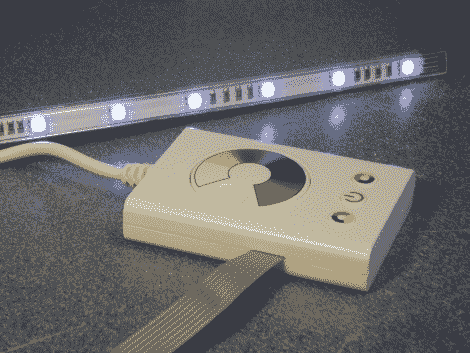

# 极简 DIODER Hack 不需要外部微控制器

> 原文：<https://hackaday.com/2011/10/25/minimalist-dioder-hack-requires-no-external-microcontroller/>

Hackaday reader [chrysn]从宜家(IKEA)拿起一个三按钮 RGB 模型 DIODER light，觉得不妨把它拆开，看看能做些什么。看过这里介绍的几个[DIODER hacks](http://hackaday.com/2009/12/29/ikea-dioder-hack/)，他知道这很容易破解，但他不想简单地重复别人已经做过的事情。

到目前为止，我们遇到的所有 DIODER 黑客都集成了某种类型的 AVR 芯片或 T2 插件来扩展其功能。[chrysn]看到控制器内部已经有一个 PIC16F684，并认为在现有硬件上安装自己的固件将是一个简单得多的解决方案。他在 DIODER 的控制板上安装了一根小的编程电缆，并使用他的 PICkit2 编程器，用定制的固件映像刷新芯片。

他的修改效果很好，[chrysn]说现有的硬件有很大的潜力来获得各种乐趣。即便如此，他指出，如果你选择的是微控制器系列，有几种 AVR 风格的替代产品可以使用。