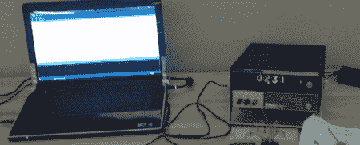

# 毫伏表谢妮钟

> 原文：<https://hackaday.com/2011/10/25/millivolt-meter-nixie-clock/>

令人惊讶的是，直到一年前，[吉米]还没有见过数码管。我们知道这很糟糕，但他已经明白了管中发光数字的美妙之处。他最近在一堆废品中发现了一个使用谢妮电子管的旧毫伏表。奇妙的橙色光芒吸引了他，所以[吉米]决定做一个时钟。

[只是](http://hackaday.com/2011/06/03/warm-tube-clock-take-2/) [关于](http://hackaday.com/2011/04/06/15-digit-nixie-clock-contains-mostly-non-useful-information/) [我们见过的所有](http://hackaday.com/2011/03/13/sleek-numitron-clock-tells-the-time-and-temperature/)谢妮时钟(包括[非时钟](http://hackaday.com/2011/09/01/using-nixie-tubes-as-robot-eyes/)构建)都依赖于为谢妮电子管构建一个控制器。控制器的范围从[谢妮 Arduino shields](http://arduinix.com/) 到 good 'ol [74141](http://neonixie.com/ic/index.html) IC。[Jimmy]意识到他不需要费心控制一个已经正常工作的毫伏表中的电子管——他只需要发送正确的电压。

对于他的时钟构建，[Jimmy]使用 Arduino 通过一组电阻分压器输出电压。例如，如果时间是 12:30，输出电压将是 12.30mV。使用这种技术，所需的电阻值不存在，因此一点点 PWM 意味着 Arduino 保持相当好的时间。

[吉米]的时钟还有一个额外的好处——因为电压在 0.01 毫伏左右变化，完成的项目就像是数字版的[维蒂纳里勋爵的时钟](http://hackaday.com/2011/10/06/vetinari-clock-will-drive-you-insane/)。它可能并不完美，但至少从垃圾中拯救了一件漂亮的设备。