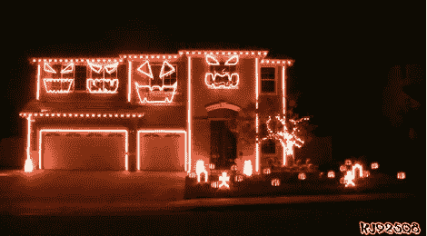

# 唱歌屋今年再次点亮万圣节

> 原文：<https://hackaday.com/2011/10/25/singing-house-lights-up-halloween-again-this-year/>

今年又让这个社区充满了阳光。每个人都知道镇上的那栋房子真的很棒，但是很少有人会举办像这样的展览。圣诞节前的一场噩梦中，四张南瓜灯脸在开场序列中遥遥领先。每个都有至少四个不同的嘴部姿势，以及两个与音频惊人地同步的眼睛方向。上图显示的主要是橙色照明，但这个家配备了可寻址的 RGB LEDs，以实现全色性能。事实上，今年它已经升级了，频道增加了 8 倍，达到 1144 个！不要错过休息后我们嵌入的表演。

我们考虑过不做这个，因为去年我们去过同一家。但是大量的提示让我们认为你们中的很多人错过了它，或者只是对众多的闪光感到高兴。不管怎样，你一天中的四分钟都是值得的——它要么会让你笑逐颜开，要么会让你庆幸没有住在这个家伙的对面。

 <https://www.youtube.com/embed/WAXMtUCcp7o?version=3&rel=1&showsearch=0&showinfo=1&iv_load_policy=1&fs=1&hl=en-US&autohide=2&wmode=transparent>

 </body> </html>