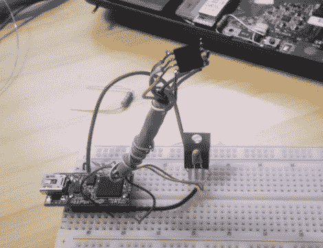

# 恢复损坏的 EEE PC BIOS

> 原文：<https://hackaday.com/2011/10/25/recovering-a-corrupted-eee-pc-bios/>

[Jeremy]手上有一台华硕 EEE PC 1000HE 上网本，它已经屈服于一个损坏的 BIOS。在大多数情况下，当 BIOS 损坏到无法修复时，人们会更换主板，但考虑到主板的价格，尤其是为便携式设备制造的主板，他干脆拒绝走这条路。

相反，他把它拆开，做了一点调查，了解华硕在上网本中使用了什么 SPI 闪存芯片。有了这些信息，他利用试验板和 DLP-USB1232H USB 转 UART 模块组装了一个 SPI flash 编程器。他无法对闪存芯片进行在线编程，所以他不得不将其拆下，并将其死插在他的编程器上。使用一些基于 Linux 的闪存工具，他能够在短时间内用一个正常工作的 BIOS 对芯片进行重新编程，使他免于昂贵的主板更换。

虽然一些主板制造商已经内置了辅助 BIOS 芯片来防止这种恢复的需要，但如果你有一些基本的焊接和 Linux 技能，知道这个过程相对简单还是很好的。

这也[不是第一次](http://hackaday.com/2009/09/25/eee-pc-bios-resurrection/)我们看到有人将 EEE 的个人电脑从悬崖边缘挽救回来——如果你正在寻找基于 Arduino 的替代品，一定要去[看看这个。](http://hackaday.com/2010/06/14/unbricking-with-the-help-of-arduino/)