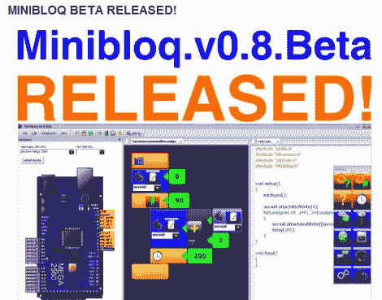

# Minibloq Arduino IDE 处于测试阶段，需要测试人员

> 原文：<https://hackaday.com/2011/10/26/minibloq-arduino-ide-is-in-beta-and-in-need-of-testers/>

如果你已经迫不及待地想尝试拖放式 Arduino 编程， [Minibloq 终于进入测试版](http://blog.minibloq.org/2011/10/minibloq-beta-released.html)，准备好让你测试了！

我们在今年 4 月提到了这个应用[，当时【Julián da Silva】还处于软件开发的早期阶段。他的图形化编程环境旨在通过一个温和的学习曲线，以一种简单的方式将 Arduino 及其衍生产品的强大功能交到孩子们的手中。](http://hackaday.com/2011/04/15/drag-and-drop-programming-gets-kids-started-early/)

自从我们第一次写 Minibloq 以来，发生了很多事情，包括非常成功的 Kickstarter 活动，以及许多小时的编程和测试。目前的测试版包括了大量的功能和编程“模块”,超出了我们今年早些时候看到的内容，所以一定要看看下面的视频，快速浏览一下新内容。

[Julián]表示，该应用程序的源代码将在他们添加一些关键功能后发布，因此，如果你有兴趣在引擎盖下偷看一眼，请留意这一点。

 <https://www.youtube.com/embed/z79N2H8Cjdc?version=3&rel=1&showsearch=0&showinfo=1&iv_load_policy=1&fs=1&hl=en-US&autohide=2&wmode=transparent>

 </body> </html>