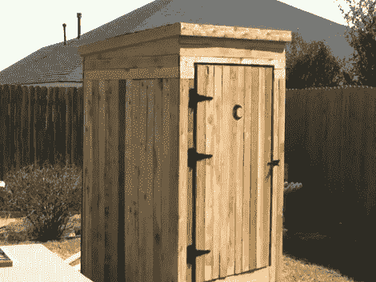

# 建在户外厕所里的万圣节时间机器模拟器

> 原文：<https://hackaday.com/2011/10/26/halloween-time-machine-simulator-built-into-an-outhouse/>

[山姆]是一个狂热的万圣节建造者，他一直在努力为今年的庆祝活动制作一个时间机器模拟器。他最近组装了上图所示的外壳。它有足够的空间让两个将被绑在适当位置的骑手，有足够的内部物品让他们有事可做。将有三个液晶显示器作为时间机器的前窗和侧窗。

在休息后的视频中(摘自他在上面链接的网页上的 v blog)[Sam]向我们展示了与此相关的所有电子设备。他的红灯是由连接在调光开关上的伺服电机控制的。有一个振动座位让乘客震动，还有一个控制面板显示时间机器的状态。问题是，令人印象深刻的不仅仅是身体构造。我们从他过去的项目中了解到[萨姆]是一个表演家，今年他没有让人失望。他花了很多时间拍摄和制作计算机图形和声音，以真正使乘坐多媒体奥德赛。

 <https://www.youtube.com/embed/7vvk_-bgyvg?version=3&rel=1&showsearch=0&showinfo=1&iv_load_policy=1&fs=1&hl=en-US&autohide=2&wmode=transparent>

 </body> </html>