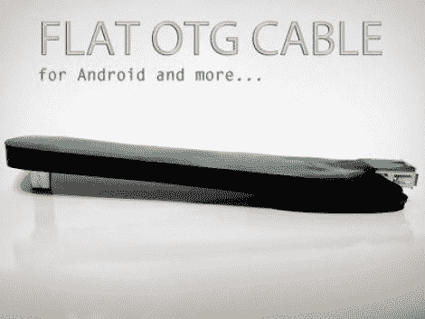

# 满足您需求的定制扁平电缆

> 原文：<https://hackaday.com/2011/10/26/custom-flat-cables-to-suit-your-needs/>

【科西莫奥兰多】有一台摩托罗拉 Xoom 平板。这是一款安卓设备，作为平板电脑非常好用，但如果你需要的话，可以通过添加键盘来兼作笔记本电脑。他遇到的问题是，他尝试的 USB 移动电缆从来没有正确的大小或方向。因此，他从他们那里搜罗零件，并自己制作了一条定制的扁平电缆。

图中的最终产品实际上使用了 protoboard 来给身体增加一些强度。[Cosimo]首先用毡尖笔在基板上标出尺寸。然后，他从尺寸不合适的商用电缆上取下连接器，用热熔胶和焊料将它们粘在电路板上。从那里，只需用一些跳线连接五条数据线和地线，并测试连续性。他用他称之为“粘性塑料光泽黑”的东西完成了这项工作，制成了一个看起来不错的箱子。如果你知道这里用的是什么产品，请留言告诉我们。