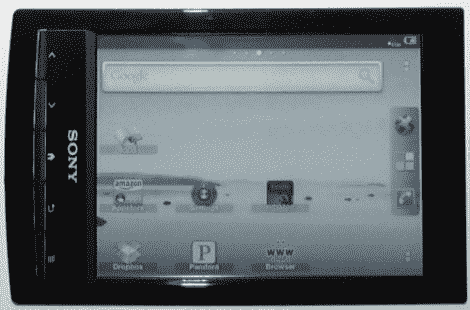

# 扎根索尼 PRS-T1 让你得到 Android 的好东西

> 原文：<https://hackaday.com/2011/10/26/rooting-sony-prs-t1-lets-you-get-at-the-android-goodies/>

哭喊着“我是根！”随着索尼的 PRS-T1 电子书阅读器的出现，这种现象再次大量出现。电子书阅读器博客采用了最初的 root 方向，然后查看了 T2 的一些你可以用 root 权限做的事情。

这个硬件是基于一个 ePaper 显示器，但我们必须说，性能似乎很棒。原始用户界面中可能会有一些缺失的功能(如翻页方式)可以通过 root 访问来修复，但我们认为增加的 Android 访问权限是值得的。在休息后的视频中，你会看到你可以进入 Android 2.2 桌面，安装任何你感兴趣的应用程序。这是一个多点触摸显示器，所以它非常适合导航，尽管由于过度的屏幕刷新，应用程序还不能很好地工作。但我们确信这将随着时间的推移而改善。值得注意的是通过 Pandora 等应用程序播放音乐的能力，以及通过 Kindle 应用程序从亚马逊图书等其他提供商加载内容的能力。

每当我们写这些根深蒂固的功能之一，我们不禁回想起[这是一个 Mac 恶搞视频](http://www.youtube.com/watch?v=Rjpn3L3bSJQ) …你会在最后几秒钟看到原因。

[https://www.youtube.com/embed/lr8-aRzdItg?version=3&rel=1&showsearch=0&showinfo=1&iv_load_policy=1&fs=1&hl=en-US&autohide=2&wmode=transparent](https://www.youtube.com/embed/lr8-aRzdItg?version=3&rel=1&showsearch=0&showinfo=1&iv_load_policy=1&fs=1&hl=en-US&autohide=2&wmode=transparent)

[谢谢内森]