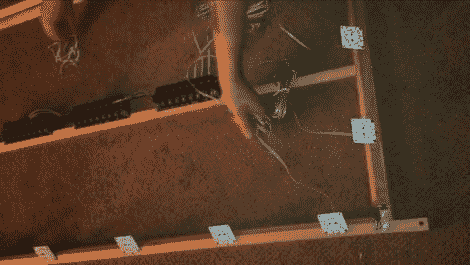

# Macetech 采用自己的流光溢彩克隆黑客

> 原文：<https://hackaday.com/2011/10/26/macetech-takes-on-its-own-ambilight-clone-hack/>

[加勒特·梅斯]决定用 60 瓦的 LED 灯来增强他的 58 英寸等离子电视。在看到大量的流光溢彩克隆体使用他的 LED 模块后，[他建立了自己强大的系统](http://macetech.com/blog/node/113)。毫不奇怪，这绝对是专业级的作品。

感谢[加勒特]在休息后的视频中展示了整个过程。我们正在谈论他的计划阶段，这些阶段经常被忽略在构建日志之外。他首先测量电视的背面，并对卫星 LED 模块的距离和角度进行一些测试，以确定应该使用多少并估计最佳间距。在开始实际建造之前，他先制作了一个框架系统。

木质框架由一个带有水平横杆的盒子组成，作为安装驱动器的地方。在边缘周围，添加了倾斜轨道，使 LED 模块的角度可调。与许多其他的流光溢彩克隆一样，[Garrett]使用 boblight 软件来驱动他的系统，我们很感激他包含了他的配置文件以供参考。一旦启动并运行，效果是惊人的(可能是致盲的)。

 <https://www.youtube.com/embed/Zz2EjUWCqI4?version=3&rel=1&showsearch=0&showinfo=1&iv_load_policy=1&fs=1&hl=en-US&autohide=2&wmode=transparent>

 </body> </html>