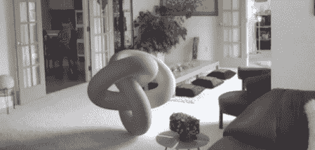

# 现在网上的图片都可以造假

> 原文：<https://hackaday.com/2011/10/27/now-pictures-on-the-internet-can-be-faked/>

我们知道它是购物的，但因为像素的原因我们无法分辨。博士生 Kevin Karsch 和其他几个朋友将在下个月的 SIGGRAPH Asia 上展示他们将物体渲染成预先存在的照片的方法。

[论文](http://kevinkarsch.com/publications/sa11-lowres.pdf) (PDF…)涵盖了【凯文】等人如何着手将不可能的物体放进照片中。用户首先定义图片的几何形状；定义桌腿，并从这些桌腿上挤出桌面。然后，通过绘制一个边界框来定义灯光，并通过一点算法技巧，将一个 3D 对象插入到场景中。

将[结果](http://hackaday.com/wp-content/uploads/2011/10/faked.jpg)与原图对比，令人瞠目结舌。对我们来说，在台球桌上 PS 一堆台球会花掉*几个小时*，而且看起来永远不会很正确。[Kevin]为 SIGGRAPH 所做的工作可以在几分钟内完成整个场景，并产生我们无法想象的结果。

还没有可下载的软件，但是算法已经有了。休息之后，请观看技术和结果的视频演示。

[https://player.vimeo.com/video/28962540](https://player.vimeo.com/video/28962540)