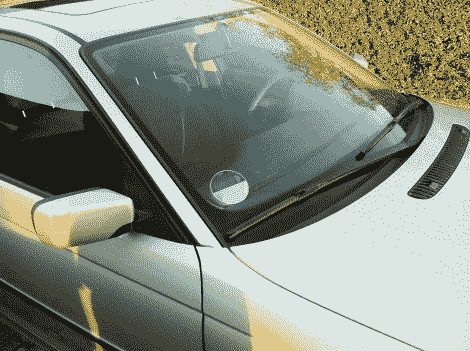

# 被黑的停车盘可以远程控制

> 原文：<https://hackaday.com/2011/10/27/hacked-parking-disc-can-be-controlled-remotely/>

如果你曾经在欧洲旅行过，你可能对停车光盘很熟悉。在许多不愿意处理停车计时器的国家，这些设备被要求安装在汽车窗户的前面，并指示车辆何时停车。当停车执法人员经过该地区时，它可以快速识别哪些汽车需要被开罚单。

[迈克尔]收到了一个别致的电子停车盘作为礼物，但是这个设备有着令人难以置信的缺陷，给他带来了各种各样的痛苦。在与制造商联系后，没有得到任何有帮助的回应，他承担起了让事情正常运行的责任。

他拆除了磁盘，发现像今天的许多产品一样，微处理器被锁在一层坚硬的树脂后面。他没有被吓倒，决定使用 ATmega 微控制器从头开始重建它，以提供基本的停车盘功能。他还在自己的硬盘上安装了一个 GSM 调制解调器和一个 GPS 接收器——前者让他能够与该设备进行通信，而后者提供准确的时间数据，同时允许他在需要时跟踪汽车的位置。

被黑的光盘的内容存在他的手套箱里，可以用他的 iPhone 控制，很容易随意调整他的停车时间。

看看下面的视频，看看他的停车钟在工作，如果你对建筑的任何部分有疑问，[迈克尔]说他非常乐意填补任何缺失的细节。

 <https://www.youtube.com/embed/yF774njhMHU?version=3&rel=1&showsearch=0&showinfo=1&iv_load_policy=1&fs=1&hl=en-US&autohide=2&wmode=transparent>

 </body> </html>