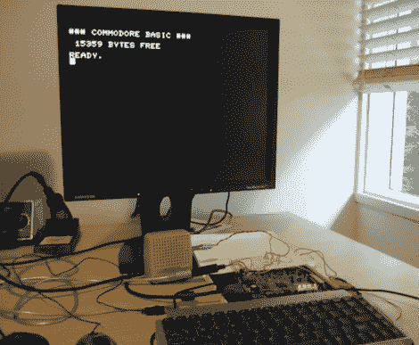

# 用 FPGA 再造 Commodore 宠物

> 原文：<https://hackaday.com/2011/10/27/recreating-the-commodore-pet-with-an-fpga/>

[Thomas]对 Commodore 计算机的热爱持续了 30 多年，不久前他决定重新创造他最喜欢的 Commodore 产品之一，宠物。正如我们所见[也有类似的项目](http://hackaday.com/2011/09/16/recreating-the-mac-plus-with-an-fpga/)，这类项目绝非易事，但【托马斯】似乎进展顺利。

他在 Digilent Nexys3 开发板上使用 Xilinx Spartan-6 FPGA，在 Verilog 中实现了 Pet。像原版一样，他的克隆体包含 16K 的 ROM 和 RAM，利用了他在之前的苹果[+项目中使用的相同的模拟 6502 微处理器。电脑的 FPGA 版本拥有 640×400 的分辨率，是原来的两倍，所以【托马斯】简单地将宠物的每个像素的大小翻倍，以填充额外的空间。

[Thomas]到目前为止已经取得了一些重大进展，包括通过串行连接从磁带图像加载游戏和其他程序的能力。他说还有一些细节需要处理，但是从这里看一切都很好！

继续阅读，看看一个简短的视频空间入侵者运行在他宠物娱乐。

 <https://www.youtube.com/embed/_wCGc7UZX6c?version=3&rel=1&showsearch=0&showinfo=1&iv_load_policy=1&fs=1&hl=en-US&autohide=2&wmode=transparent>

 </body> </html>