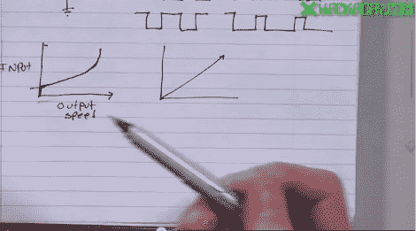

# 视频:ATmega328p 上的 PWM

> 原文：<https://hackaday.com/2011/10/27/video-pwm-on-the-atmega328p/>

本周，我们继续我们系列的另一个视频，讲述如何使用 c 语言为 ATmega328p 处理器编程。ATmega328p 是许多 Arduino 板的核心。如果您一直在使用它们，但想为您的项目增加一些马力，这一系列视频适合您。在本视频中，[Jack]讲述了各种类型的脉宽调制(PWM)。您可以使用 PWM 来控制电机速度、LED 亮度或生成模拟波形。[Jack]展示了如何设置处理器来执行锁定反相 PWM，以驱动 3pi 机器人的车轮，然后演示了一个简短的程序，其中显示了运行中的代码。

如果您错过了本系列的前几篇文章，并且想看看它们……
介绍以及如何设置开发环境:[单击此处](http://hackaday.com/2011/10/14/video-learning-to-program-for-the-atmega328p-part-i/)
使用 I/O 引脚:[单击此处](http://hackaday.com/2011/10/20/video-performing-io-with-the-atmega328p/)

视频是在休息之后……

[https://www.youtube.com/embed/QYQE_za8KQQ?version=3&rel=1&showsearch=0&showinfo=1&iv_load_policy=1&fs=1&hl=en-US&autohide=2&wmode=transparent](https://www.youtube.com/embed/QYQE_za8KQQ?version=3&rel=1&showsearch=0&showinfo=1&iv_load_policy=1&fs=1&hl=en-US&autohide=2&wmode=transparent)