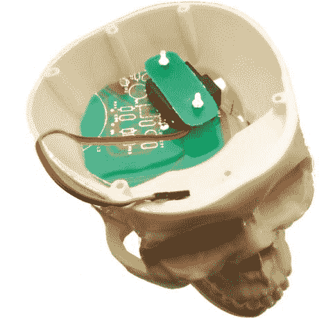

# 万圣节技巧:简单的机器人头骨是一个完美的最后装饰

> 原文：<https://hackaday.com/2011/10/27/halloween-hacks-simple-robotic-skull-is-a-perfect-last-minute-decoration/>

如果你还没有花时间把你的装饰品放在一起，是时候开始行动了。万圣节就要到了，大型精心制作的展示几乎是不可能的，但是[Boris]和 Open Electronics 的团队有一个简单的项目，肯定会受到“不给糖就捣蛋”的人的欢迎。

他们用一个你可能在任何万圣节商店都能找到的廉价塑料道具，组装了一个简单的会说话的头骨，它会随着音乐或声音的传播而移动。头骨的嘴由安装在脑腔内的单一伺服系统移动，该伺服系统由 Arduino 控制。Arduino 监控正在播放的源音频的音量，并相应地启动伺服系统。

它快速、简单、有效——非常适合最后一分钟的装修项目。如果你有更大的野心，你总是可以不用太多额外的努力就把一个完整的骷髅头合唱团组合在一起——只需要几个额外的骷髅头和一些伺服系统就可以很好地完成这个任务。

看看下面头骨动作的快速视频，以及另一个展示伺服机构如何移动其嘴的短片。

 <https://www.youtube.com/embed/jsKBcH7xZBg?version=3&rel=1&showsearch=0&showinfo=1&iv_load_policy=1&fs=1&hl=en-US&autohide=2&wmode=transparent>

 <iframe class="youtube-player" width="800" height="480" src="https://www.youtube.com/embed/1i28teQTdpQ?version=3&amp;rel=1&amp;showsearch=0&amp;showinfo=1&amp;iv_load_policy=1&amp;fs=1&amp;hl=en-US&amp;autohide=2&amp;wmode=transparent" allowfullscreen="true" style="border:0;" sandbox="allow-scripts allow-same-origin allow-popups allow-presentation"/> </body> </html>