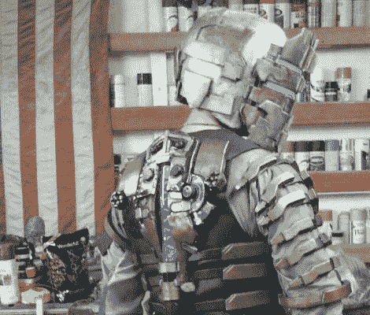

# 你可能没有时间来做这件不可思议的死亡空间服装。

> 原文：<https://hackaday.com/2011/10/28/you-probably-do-not-have-time-to-build-this-incredible-dead-space-costume/>

当一个失业的水手有大把时间的时候会发生什么？很明显，他们成为了非常熟练的道具建造者。再说一次，我们唯一的参考点是[索索里]出色的[死亡宇航服建造](http://protagonist4hire.blogspot.com/2011/10/isaac-clarkes-engineering-rig-costume.html)。

[Throssoli]开始了这个雄心勃勃的项目，为头盔设定了一个月的最后期限。虽然他没有达到截止日期，但结果非常棒，非常符合游戏模型。注意到人们在野外对头盔的反应，并承认他真的想要游戏中看到的全套工程服，[Throssoli]开始复制整个装备，包括照明面罩和背部安装的脊柱状健康和静态指示器。它真正需要的是靴子里的铅块，让它有那种标志性的跺脚艾萨克的感觉。这一构建融合了许多我们通常在其他游戏相关道具构建中看到的技术，例如在[惠特利木偶](http://hackaday.com/2011/08/11/portal-puppet-probably-wont-kill-us/)中看到的黑色冲洗和风化效果，以及在这个[传送门炮塔](http://hackaday.com/2011/05/10/diy-portal-turret-is-looking-pretty-good/)构建中看到的模具制作，甚至还有[愚蠢的朋克头盔](http://hackaday.com/2009/10/13/daft-punk-replica-helmet/)。请记住[Throssoli]对道具或服装制作并不陌生，他的[作品组合](http://protagonist4hire.blogspot.com/p/project-portfolio.html)包括光晕盔甲和道具、各种《星球大战》服装、质量效应材料、你能想到的掠夺者装备。我们可以很容易地花半天时间仔细阅读网站上的所有版本，所以你自己去看看吧！

[via [Reddit](http://www.reddit.com/r/gaming/comments/lq0z4/i_wish_i_had_this_level_of_creativity_and_patience/)