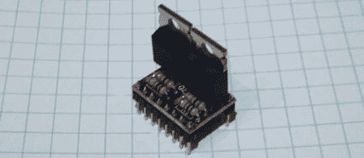

# Pololu 兼容继电器驱动器

> 原文：<https://hackaday.com/2011/10/28/pololu-compatable-relay-driver/>

[Bart]制造了几十个兼容 Pololu 的继电器驱动器。

如果你有 Reprap，你可能熟悉 [Pololu 步进电机驱动器](http://www.pololu.com/catalog/product/1201)。这些小部件为 [Gen 6](http://reprap.org/wiki/Generation_6_Electronics) 、 [RAMPS](http://reprap.org/wiki/RAMPS) 或 [Sanguinololu](http://reprap.org/wiki/Sanguinololu) Reprap 电子设备提供步进电机控制。不过，所有这些电路板都有一个小问题。除了步进电机，没有办法从这些板上控制任何大功率设备。控制一个自制 CNC 路由器的主轴会很棒，但是除了在你的 x 轴上安装一个 Dremel，你就没那么幸运了。

[Bart]的继电器驱动器从普通 Pololu 步进驱动器获取步进和方向输入，并将每个输入连接到一个 MOSFET。从那里，一个继电器可以连接到驱动器来控制路由器的主轴，或者一个自制激光切割机的一大堆风扇。

原理图和 [Gerber 文件](http://www.buildlog.net/documents/C16014_rev1.zip)在【Bart】的 webzone 上。零件数量*非常少*，整个电路板可以很容易地构建在一块 perfboard 上。查看跳跃另一侧的演示。

 <https://www.youtube.com/embed/8hWp6x_WIJA?version=3&rel=1&showsearch=0&showinfo=1&iv_load_policy=1&fs=1&hl=en-US&autohide=2&wmode=transparent>

 </body> </html>