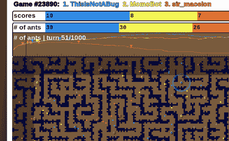

# 蚂蚁在人工智能挑战赛中一决雌雄

> 原文：<https://hackaday.com/2011/10/28/ants-duke-it-out-in-the-ai-challenge/>

所有这些橙色、青色和黄色的点代表了数码蚂蚁争夺霸权。这是一场在谷歌支持的编程比赛中看谁的 AI 代码更好的比赛:[AI 挑战赛](http://aichallenge.org/)。在你继续下一个故事之前，请认真地为自己试一试。这是一种让更多人对人工智能编程感兴趣的方式，他们声称你可以在短短五分钟内启动并运行。

人工智能挑战最好的部分可能是它们提供的资源。初学者工具包提供了 22 种不同编程语言的示例代码作为起点。快速入门教程将帮助你思考人工智能编码的主要组成部分。

游戏由每个团队的蚂蚁山组成，水作为障碍，食物收集作为目标。胜者决定于谁摧毁了更多的敌蚁山丘，并聚集了更多的资源。它提供了一些有趣的挑战，如如何寻找食物和敌人的蚁丘，如何绘制从一点到另一点的路径等。但是，如果你对视频游戏编程或机器人感兴趣，你在这个过程中学到的技能将对你以后的黑客攻击有很大帮助。