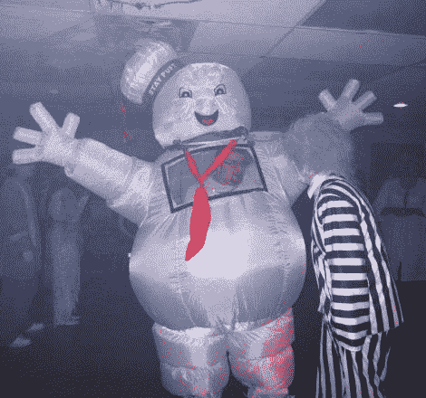

# 万圣节服装:由充气草坪装饰品制成的比真人还大的服装

> 原文：<https://hackaday.com/2011/10/29/halloween-hacks-larger-than-life-costume-made-from-an-inflatable-lawn-ornament/>

[Brian]正试图决定今年万圣节的服装，在查看他的草坪装饰品时，灵感出现了。在他的收藏中，他有一个 9 英尺高的充气棉花糖人，作为一个喜欢[去大的地方或者回家](http://hackaday.com/2010/12/28/jumbo-size-new-years-countdown/)的人，他知道他必须找到一种方法来穿它。

他必须解决的第一个任务是确保他可以在旅途中保持显示器充气。他沮丧地看到，风扇的电源额定为 12v 交流电，但当他把它连接到 DC 电源时，它工作得很好。虽然他有自己的猜测，但他不能 100%确定它为什么会工作，但他还是照做了，将它连接到电池上，这样就可以在整个派对期间保持服装充气。

解决了这个问题后，他更加关注服装的流动性，增加了一个清晰的窗口，让他可以看到，同时调整了其他一些小项目。

这套服装看起来很棒，我们确信[布莱恩]会再次成为晚会的焦点。