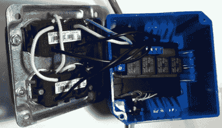

# Arduino 控制的四插座

> 原文：<https://hackaday.com/2011/10/31/arduino-controlled-four-socket-outlet/>

永远不要介入一个男人和他的香肠之间。[Mike]需要一种方法来控制肉类腌制设备的温度、湿度和气流。当然，他可以修改冰箱和加湿器来分别控制，但[Mike]认为最好的办法是用 Arduino 来控制[线电压。](http://www.mikerags.com/node/24)

[Mike]从他在家得宝(Home Depot)花了几美元买来的四插座墙壁房屋开始建造。在连接好每个插座以便可以独立控制后，他开始设计一个四端口继电器板。这是一个非常简单的构建——四个 10 安培继电器和几个端子板。为了便于制造， [PCB](http://www.mikerags.com/sites/default/files/user3/other/relay_board/Relay_PCB.jpg) 在 Eagle 设计为单面电路板。

继电器板是为了与四个插座一起安装在蓝色的盒子里，所以钻了几个孔用于电源线和控制线。整个装置被放在一起并经过测试。[Mike]发布了一个他的可控插座以 10 赫兹闪烁灯泡的视频。休息后看看灯开关。

[https://www.youtube.com/embed/B5lXlHG156Y?version=3&rel=1&showsearch=0&showinfo=1&iv_load_policy=1&fs=1&hl=en-US&autohide=2&wmode=transparent](https://www.youtube.com/embed/B5lXlHG156Y?version=3&rel=1&showsearch=0&showinfo=1&iv_load_policy=1&fs=1&hl=en-US&autohide=2&wmode=transparent)