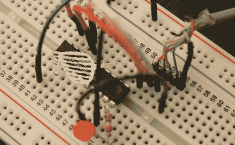

# 初学者概念:我们会让你完成，但首先这个关于 Arduino 的教程中断

> 原文：<https://hackaday.com/2011/11/08/were-gonna-let-you-finish-but-first-this-tutorial-on-arduino-interrupts/>

好了，抛开一年前的流行文化参考，[Kyle]给我们写了一行，向我们展示了他关于用 Arduino 使用中断的教程。鉴于一般 Arduino AVR 的单核特性，您几乎有两种选择来监控偶尔的非定时输入:要么定期检查输入(这有完全错过信号的风险)，要么设置中断来暂停芯片的正常操作。显然，使用中断可以节省大量的时钟周期，因为你不用一遍又一遍地轮询管脚。[Kyle]计划在后续教程中介绍基于定时器的中断，这在生成频率等内容时会派上用场。

寻找更多 Arduino 基础知识？Arduino 上的 [Basic 怎么样？如果你需要在基础方面下功夫，也可以看看我们其他的](http://hackaday.com/2011/08/28/basic-programming-on-an-arduino/)[初学者概念](http://hackaday.com/?s=beginner+concepts)帖子。