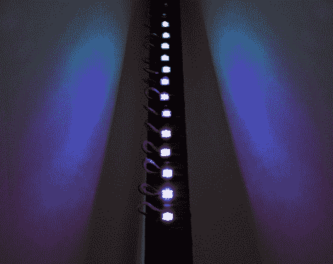

# Wine-o-Meter 量化了你的单身派对不良行为

> 原文：<https://hackaday.com/2011/10/31/wine-o-meter-quantifies-your-bachelor-party-bad-behavior/>

[Phil]为 LED 餐桌项目准备了一堆 Shiftbrite 模块，但在他开始之前，他决定用它们来为朋友的单身派对制作一个道具。预计会有大量的醉酒狂欢，他建造了[Arduino Wine-o-Meter](http://www.substatica.com/wineometer/)——一个嘉年华“测试你的力量”风格的呼气测醉器。

25 个 Shiftbrite 模块排成一列，连接到一个藏在纸板盒里的 Arduino。Arduino 从 MQ-3 气体/酒精传感器获取读数，该传感器是从另一个呼气测醉器组装[Phil]中抢救出来的。虽然在过去已经注意到这个传感器非常不准确，但它似乎很好地满足了他的目的。由于他的游戏是基于测量玩家之间的血液酒精含量，而不是获得准确的血液酒精含量读数，因此设备的不良校准对每个人的影响应该是一样的。

它看起来很酷，我们想象它将确保派对在深夜保持活跃。查看下面的视频，看[Phil]带你看他的 Wine-o-Meter 的演示。

[https://www.youtube.com/embed/L5NVRG9T6J8?version=3&rel=1&showsearch=0&showinfo=1&iv_load_policy=1&fs=1&hl=en-US&autohide=2&wmode=transparent](https://www.youtube.com/embed/L5NVRG9T6J8?version=3&rel=1&showsearch=0&showinfo=1&iv_load_policy=1&fs=1&hl=en-US&autohide=2&wmode=transparent)