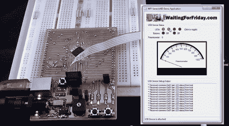

# 当将 PC 端应用程序与 USB 微控制器集成在一起时，你知道自己在做什么吗？

> 原文：<https://hackaday.com/2011/10/31/do-you-know-what-youre-doing-when-integrating-pc-side-apps-with-usb-microcontrollers/>

微处理器(PIC、AVR 等)中集成 USB 外设的出现。)无疑为开发 USB 设备做了大量工作，更不用说减少这些设计中的硅元件了。但是，当使用用户友好的应用程序来控制它们时，您知道自己在做什么吗？[Simon Inns]在他最近的教程中对此提供了帮助。他展示了如何使用支持 USB 的 AVR 芯片和你自己的 Windows 应用程序。

休息过后，你可以看到上面截图的视频。这是他自己制作的开发板，其中包含 ATmega32U4，以及 USB-B 端口，led，电位计和一些开关。仔细看看，我们喜欢他在电路板底部使用的试验板友好接头，以断开所有引脚。

他的演示展示了 Windows 应用程序打开和关闭电路板上的 led，以及显示当前电位计位置和屏幕刻度盘的 ADC 数据。他的代码包包括硬件设计、固件和他正在做的事情所需的应用软件。

 <https://www.youtube.com/embed/5CgSLAkTgWk?version=3&rel=1&showsearch=0&showinfo=1&iv_load_policy=1&fs=1&hl=en-US&autohide=2&wmode=transparent>

 </body> </html>