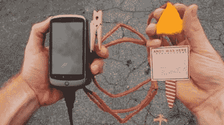

# 尿领土标记，现在为人类！

> 原文：<https://hackaday.com/2011/11/02/urine-territory-marking-now-for-humans/>

虽然狗和其他动物喜欢用尿液来标记它们的领地，但这种技术一直被人类普遍忽视。不要再绝望了，智人同胞们，我们现在已经发展出通过你们的信息流在 foursquare 上签到的能力。这个装置被描述为“标记你的领地”

虽然这目前还不能在商店里买到(虽然很明显 10，000 美元可以让你造一个)，但是[Instructables]用户[blorgggggg]已经提供了建造你自己的的[方向。该系统由一台](http://www.instructables.com/id/Pee-to-Check-In-to-Foursquare-Mark-Your-Territor/#step1) [Arduino](http://www.arduino.cc/) 和一部安卓手机驱动。尿液标签既有用于插入草地等的尖端，又有用于“更多城市环境”的粘性背面

休息后的视频给出了相当多的背景，试图从物理世界、动物等方面证明这样一个系统的合理性，但这个借口是否能让你免于公共场合小便的指控令人怀疑。已经警告过你了。

 <https://www.youtube.com/embed/rRdfeb7vDWg?version=3&rel=1&showsearch=0&showinfo=1&iv_load_policy=1&fs=1&hl=en-US&autohide=2&wmode=transparent>

 </body> </html>