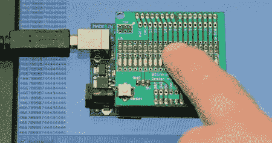

# 将 led 变成照相机

> 原文：<https://hackaday.com/2011/11/01/turning-leds-into-a-camera/>

[Udo]想出了如何将一束 led[变成一个分辨率非常低的相机](http://blog.blinkenlight.net/experiments/measurements/led-camera/)。

这个版本是基于[Udo]在过去一年中开发的[闪光灯防护罩](http://blog.blinkenlight.net/2011/11/01/hello-world/)。相机的工作原理是 LED 和光电二极管之间没有太大的区别；发光二极管可以发光和检测。实际上，LED“相机”与平板扫描仪中的图像传感器[线性 CCD 阵列](http://www.pjrc.com/tech/ccd/)并没有什么不同。

将他的闪光灯罩连接到他的 Arduino 和电脑后，[Udo]写了一张草图，可以从他的 LED 摄像机中捕捉 17 个值。这些值是通过串行连接拍摄的，其中高亮度显示为较小的数字，低亮度显示为较大的数字。

[Udo]已经用他的闪光灯盾做了许多其他很酷的事情，像[一个视觉暂留实验](http://blog.blinkenlight.net/experiments/basic-effects/pov-generator/)和[假装成[迈克尔·奈特]](http://blog.blinkenlight.net/experiments/basic-effects/knight-rider/)。休息之后，请观看视频，观看[Udo]的线性 LED 摄像机演示。

[https://www.youtube.com/embed/3unSMko8m4Q?version=3&rel=1&showsearch=0&showinfo=1&iv_load_policy=1&fs=1&hl=en-US&autohide=2&wmode=transparent](https://www.youtube.com/embed/3unSMko8m4Q?version=3&rel=1&showsearch=0&showinfo=1&iv_load_policy=1&fs=1&hl=en-US&autohide=2&wmode=transparent)