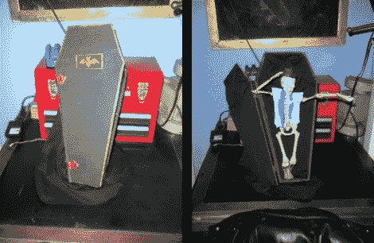

# 骷髅乐队表演了一首疯狂曲调风格的歌曲和舞蹈

> 原文：<https://hackaday.com/2011/11/01/skeleton-does-a-looney-tunes-style-song-and-dance/>

[凯文·哈灵顿]用棺材里的骷髅扔出一个曲线球。他没有去寻求廉价的惊吓，而是唤起了对老卡通片的回忆，当这个瘦骨嶙峋的人物载歌载舞的时候。当它被激活时，身体前倾，挂在棺材外面，穿着一件破烂的燕尾服和礼帽。你可以听到伺服工作，因为他们给颠簸但现实的运动曲调“你好！《马宝贝》中的[真正的密歇根 j .青蛙风格](http://www.youtube.com/watch?v=4HAjhtPZGDY)。经典！

他计算了一下，把骨架组装在一起，加上从电脑上控制它的 DyIO 模块，大约花费了 36 美元。总共使用了四个伺服系统，用一些钢缆连接到骨架上。通过计算机连接它，比仅仅使用能够播放音频的微控制器更容易使音乐与动作同步。代码可从顶部链接的网站获得，休息后会嵌入演示视频。

这也可以通过[使用 Arduino 作为 DMX 控制器](http://hackaday.com/2011/11/01/looking-toward-christmas-decor-by-learning-about-dmx/)来实现。

 <https://www.youtube.com/embed/ZRUoMjDTQ4Q?version=3&rel=1&showsearch=0&showinfo=1&iv_load_policy=1&fs=1&hl=en-US&autohide=2&wmode=transparent>

 </body> </html>