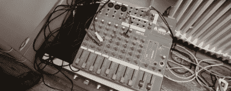

# 让你的音响师更加烦恼

> 原文：<https://hackaday.com/2011/11/01/annoy-your-sound-guy-even-more/>

“我在混音中听不到自己的声音，”“好的，伙计，我 8 点到，”以及“伙计，我们还需要 4 个麦克风。”这些话的每一个都记录在精算表中，对你的音响技术中风的风险不是好兆头。幸运的是，有一种[甚至更好的方式](http://shackspace.de/?p=2509)来杀死你的音响师，这一次，它实际上相当聪明。

斯图加特的 hackerspace Shackspace 发明了 Noiseplug。这是一个非常小的建筑，几乎可以放入四分之一英寸的插孔。这一切都是由手表电池供电的微型~~(未知)~~ ATtiny9 微控制器贴片完成的。

从噪音塞里出来的音乐真的很有趣。微控制器上的所有代码都是用 C 编写的[单行代码。类似的“算法芯片调”程序可以在任何个人电脑上运行:看看](http://shackspace.de/wiki/doku.php?id=project:algorithmicsoundscapes)[这些](http://www.youtube.com/watch?v=GtQdIYUtAHg&feature=related) [三个](http://www.youtube.com/watch?v=qlrs2Vorw2Y) [例子](http://www.youtube.com/watch?v=tCRPUv8V22o)。

这些潜在的国际混淆 C 代码竞赛的参赛作品把字符扔进一个 8 位 PCM 流。将这些程序的输出通过管道传输到/dev/audio 将会生成一首真正的歌曲——完全用一行 c 编写。

当然，[@dop3j0e]本可以让他的 Noiseplug 变得不那么令人讨厌，但是声音技术不被重视是有原因的，对吗？

休息之后，听听 Noiseplug in 的动作，还有几首 C 语言的单句歌曲。

<https://player.vimeo.com/video/31411308>

 <iframe class="youtube-player" width="800" height="480" src="https://www.youtube.com/embed/GtQdIYUtAHg?version=3&amp;rel=1&amp;showsearch=0&amp;showinfo=1&amp;iv_load_policy=1&amp;fs=1&amp;hl=en-US&amp;autohide=2&amp;wmode=transparent" allowfullscreen="true" style="border:0;" sandbox="allow-scripts allow-same-origin allow-popups allow-presentation"/> <iframe class="youtube-player" width="800" height="480" src="https://www.youtube.com/embed/qlrs2Vorw2Y?version=3&amp;rel=1&amp;showsearch=0&amp;showinfo=1&amp;iv_load_policy=1&amp;fs=1&amp;hl=en-US&amp;autohide=2&amp;wmode=transparent" allowfullscreen="true" style="border:0;" sandbox="allow-scripts allow-same-origin allow-popups allow-presentation"/> <iframe class="youtube-player" width="800" height="480" src="https://www.youtube.com/embed/tCRPUv8V22o?version=3&amp;rel=1&amp;showsearch=0&amp;showinfo=1&amp;iv_load_policy=1&amp;fs=1&amp;hl=en-US&amp;autohide=2&amp;wmode=transparent" allowfullscreen="true" style="border:0;" sandbox="allow-scripts allow-same-origin allow-popups allow-presentation"/> </body> </html>