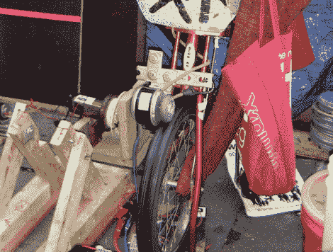

# 占领运动在发电机被没收后增加人力

> 原文：<https://hackaday.com/2011/11/02/occupy-rigs-up-human-power-after-generators-are-confiscated/>

看起来纽约消防队没收了祖科蒂公园占领华尔街抗议者的所有燃气(或生物柴油)发电机。显然消防队长认为发电机是火灾隐患。这似乎是一个可疑的说法。休息后视频中的一个镜头清楚地显示灭火器就在附近，但我们不是消防法规方面的专家。我们敢打赌，人们担心的是如果场景变得暴力，周围会有可燃物…或者只是想用失去热源来给团队施压。

这场运动非但没有失败，反而得到了波士顿一个邻近抗议团体的帮助。随着志愿者踩踏板发电，自行车动力取代了丢失的发电机。麻省理工学院的学生发挥他们的技能，帮助设计了多个可供社区使用的充电站。这不足以为正在进行的占领者提供热量，但它确实让他们为自己的电子设备充电，这有助于确保当前的信息仍然从这个活动中心流出。

有没有人有办法切断热源，而不会惹恼当地官员？如果有，留下评论。如果你已经写了一篇关于这个话题的文章，不要害怕[发送关于它的提示](http://hackaday.com/contact-hack-a-day/)。

[https://www.youtube.com/embed/5KFpwAgVJuk?version=3&rel=1&showsearch=0&showinfo=1&iv_load_policy=1&fs=1&hl=en-US&autohide=2&wmode=transparent](https://www.youtube.com/embed/5KFpwAgVJuk?version=3&rel=1&showsearch=0&showinfo=1&iv_load_policy=1&fs=1&hl=en-US&autohide=2&wmode=transparent)

[感谢 1116 Birchmont]