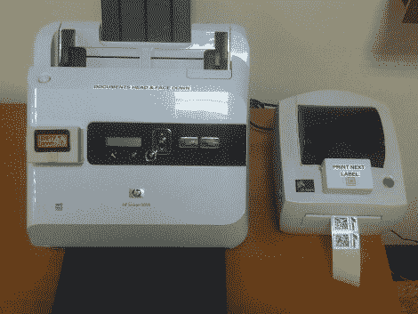

# 使用您现有的硬件自动扫描和归档

> 原文：<https://hackaday.com/2011/11/02/using-your-existing-hardware-to-automate-scanning-and-filing/>

这个一定很有趣，因为它什么都有。硬件、固件、网络和服务器脚本一起工作[为您的企业创建一个归档、扫描文档中心](http://eopossum.blogspot.com/search/label/ULAN%20Scanner)。最棒的是[Janis Jakaitis]被要求将此作为他工作的一部分(我们肯定有一群 IT 人员对此表示怀疑，但对我们来说这听起来很有趣！).

目标是使用现有的文档扫描仪创建 pdf，然后存储在网络上的文件系统中。当然，它需要是自动的。第一个大问题是扫描仪只有 USB 接口，当连接到 USB-LAN 桥时，设备上的按钮不再工作。[Janis]组装了一个 Arduino 电路，增加了那个按钮，还有一个显示你扫描工作状态的显示器。

下一个问题是让归档系统将文档识别为唯一的文件。这里的解决方案是生成一个独特的条形码标签，可以在扫描前贴在页面上。由于这是一个独立的设置，让标签打印机吐出一个独特的标签是很棘手的。他已经让 Arduino 与扫描仪一起工作，所以[Janis]决定也用它来驱动这项条形码工作。它调用运行在服务器上的 Lua 脚本，然后将下一个唯一代码推送到打印机。

将所有内容结合在一起，休息后您将获得演示视频。

[https://www.youtube.com/embed/tdxwOx3m-fM?version=3&rel=1&showsearch=0&showinfo=1&iv_load_policy=1&fs=1&hl=en-US&autohide=2&wmode=transparent](https://www.youtube.com/embed/tdxwOx3m-fM?version=3&rel=1&showsearch=0&showinfo=1&iv_load_policy=1&fs=1&hl=en-US&autohide=2&wmode=transparent)