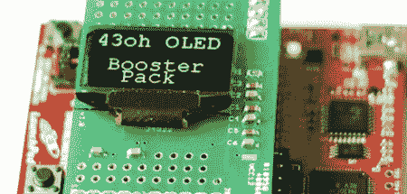

# 为您的 TI Launchpad 提供廉价的有机发光二极管显示器

> 原文：<https://hackaday.com/2011/11/02/cheap-oled-display-for-your-ti-launchpad/>

在 43oh 论坛上的家伙们一直在为 TI Launchpad 开发有机发光二极管显示器增强包。现在在 43oh 商店可以买到[的增压包，而且价格相当便宜。](http://store.43oh.com/index.php?route=product/product&product_id=57)

TI Launchpad 是一款非常棒的小型开发板，拥有一群贪婪的粉丝。我们已经在 Hack a Day 上看到了很多使用发射台的项目——从[的采访计](http://hackaday.com/2011/08/19/using-an-msp430-for-time-lapse-photography/)到[的鸡舍](http://hackaday.com/2011/09/21/a-solar-powered-automatic-chicken-coop/)的一切。不幸的是，MSP430 没有“应该保持匿名”的市场渗透率，所以很少看到新的发射台“盾牌”

在过去的一个月里，43oh 论坛上的[bluehash]一直在努力工作，以组装他的有机发光二极管助推器包。显示器是 128×64 像素，亮度高得令人难以置信，这是我们对有机发光二极管显示器的期望。显示器软件基于 SSD1306 驱动程序，带有两个字体包——Courier New large 和 small。对于一个不被看好的开发板来说，这是一个不错的小套件。