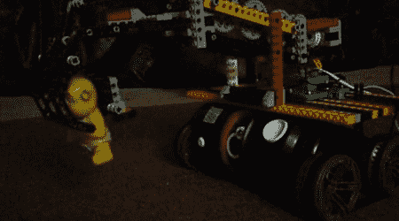

# 带有乐高抓手的拆弹机器人

> 原文：<https://hackaday.com/2011/11/03/bomb-disposal-robot-with-lego-gripper/>

[Krash]在破解他的间谍装备 TRAKR 时很开心；我们很幸运他能在可疑的史莱克玩偶爆炸前把它移走。

现已停产的[间谍装备 TRAKR](http://www.spygear.net/spy-gear/item.php?key=64) 是【Krash】的建造基础。这个小小的遥控玩具将视频传输回它的遥控器，让我们非常嫉妒我们侄子拥有的那些棒极了的玩具。谢天谢地，TRAKR 背后的工程师们让*变得非常*易被黑客攻击，正如[通过黑客攻击一天自己的【菲尔·伯吉斯】所证明的](http://hackaday.com/?s=TRAKR)。

[Krash]通过在 TRAKR 板上的 GPIO 引脚中放置几个公接头来开始他的构建。之后下载了 [TRAKR SDK](http://www.spygear.net/help/files/TRAKR_APP_PRIMER_V1.2.zip) 。他用了几个[快速电路](http://www.snapcircuits.net/)来验证他的 TRAKR 软件工作正常，然后开始制造乐高机械臂。这个手臂是通过 H 桥集成电路(Krash)供电的，这个集成电路就在他的 Snap Circuits 设备旁边。

对于一堆玩具来说，这是个不错的构造。休息之后看看[Krash]的拆弹机器人视频。

<https://player.vimeo.com/video/24143672>

 </body> </html>