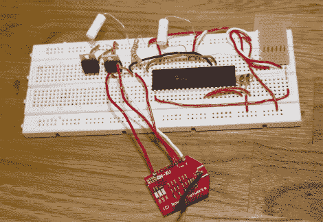

# 使用 PIC 微控制器的 WebSocket

> 原文：<https://hackaday.com/2011/11/03/using-websocket-with-pic-microcontrollers/>

[Blaise Jarrett]一直在努力让 WebSocket 协议与 PIC 微控制器很好地配合。在这里，他使用 PIC 18F4620 和漫游网络 RN-XV WiFi 模块将设备接入网络。他开始使用较小的处理器，但遇到了一些 RAM 限制，所以在选择硬件时要记住这一点。

这个项目是在几天前看到 mBed 特性后产生的，该特性将该板与 WebSocket 库和 HTML5 结合起来，实现了一些非常惊人的东西。[Blaise]在 web 客户端上还没有太多的改进，但他已经重新创建了数据传输方法，并通过迁移到 WebSockets 的更新版本 13 来改进该项目。该协议是一种移动的目标，因为它仍处于标准化过程中。

后端是一个用 python 写的叫做 AutoBahn 的服务器。它附带了客户端 web 服务器示例，这让他有机会快速上手并运行。从那里，他开始着手研究 WebSocket 通信。它们是一组字符串，看起来非常像 HTML 头。他概述了每个命令以及在实现过程中可能遇到的一些障碍。在阅读了如何实现这一点后，它似乎没有我们想象的复杂，但很明显为什么您需要一个健康的 RAM 来完成它。