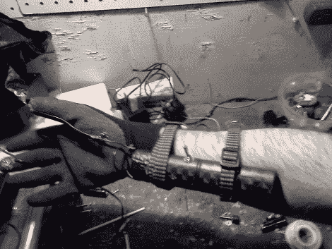

# 泰瑟枪手套的第二次运行使用灭虫器零件

> 原文：<https://hackaday.com/2011/11/03/second-run-at-taser-gloves-uses-bug-zapper-parts/>

[Jair2k4]扔掉了 Altoids 罐，并为他最新的泰瑟枪手套找到了一个新的电压源。普通读者会记得[的第一次迭代](http://hackaday.com/2011/10/20/taser-gloves-are-a-bad-idea/)，它使用包含一次性相机闪光电路的腕戴式外壳，用手电击某人。这是一个完整的返工，但它遵循相同的概念。

新的电击电路来自苍蝇拍形状的灭虫器。我们以前见过这些手持设备，并认为它们是一个噱头，但[Jair k4]得到了其中的几个，并发现它们可以发出高达 2300 伏的火花。他开始工作，去掉手柄顶端的网球拍样式的网格。他在一些橡胶手套上焊接了一些接触点，这些接触点一直延伸到他的中指和拇指尖。原来的手柄被保留下来，因为它是一个很好的电池座，绑在他的前臂上效果很好。

有用吗？你打赌——甚至歌唱他的臂毛，在他的皮肤上留下伤痕。休息之后自己看吧。是的，这是你应该重新创造的黑客列表中的一条！

 <https://www.youtube.com/embed/Bo_rmQXJl90?version=3&rel=1&showsearch=0&showinfo=1&iv_load_policy=1&fs=1&hl=en-US&autohide=2&wmode=transparent>

 </body> </html>