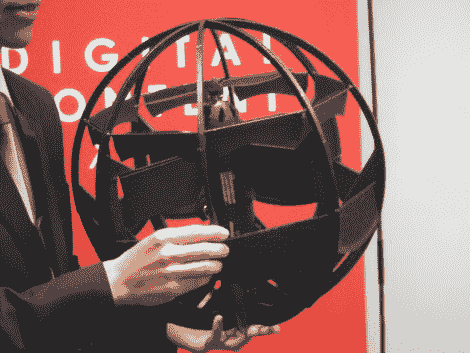

# 看，是直升机！是一架飞机！这是一个滚动机器人！

> 原文：<https://hackaday.com/2011/11/04/look-its-a-helicopter-its-a-plane-its-a-rolling-robot/>

直升机飞机球机器人听起来像是[荷马·辛普森]想出来的发明，但它是对这种机器所能做的事情的相当准确的描述。它是由日本国防部的研究人员开发的。单个螺旋桨让它的操作更像直升机。但当它需要快速到达某个地方时，身体会重新定位，螺旋桨在前面，而那些黑色面板则充当翅膀。最后，球形主体让它沿着表面行进，垂直或水平。它甚至可以沿着地面滚动。

休息之后，你可以看到 2011 年数字内容博览会的飞行演示视频。这让我们对控制界面产生了怀疑。哪一部分是前侧，它如何知道操作者打算将它转向哪个方向？也许有关于控制单元的基本方向的反馈？我们不知道这些问题的答案，但我们认为它很科幻。这让人想起尼尔·斯蒂芬森的小说《钻石时代》中的狗舱空气静力防御网格。

[https://www.youtube.com/embed/pF0uLnMoQZA?version=3&rel=1&showsearch=0&showinfo=1&iv_load_policy=1&fs=1&hl=en-US&autohide=2&wmode=transparent](https://www.youtube.com/embed/pF0uLnMoQZA?version=3&rel=1&showsearch=0&showinfo=1&iv_load_policy=1&fs=1&hl=en-US&autohide=2&wmode=transparent)

[谢谢罗伯]