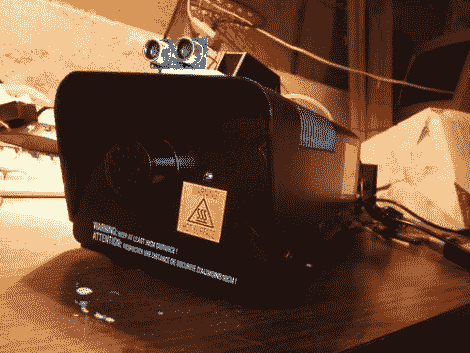

# 万圣节黑客:运动感应雾机

> 原文：<https://hackaday.com/2011/11/04/halloween-hacks-motion-sensing-fog-machine/>

[monkeysinacan]想在他的万圣节展示中增加一个造雾机，但是他说更便宜的消费级模型是相当难以驾驭的野兽。他列举了短的工作周期和复杂的烟雾控制作为他对这种烟雾器的两个最大的不满。他决定使雾化过程更容易管理，并修改了他的，只有当有人在附近行走时才会产生雾。

这种设置的一个明显问题是设备准备产生雾所需的预热时间。如果它只在有人走过时才打开，[monkeysinacan]每次都会错过他的目标。为了确保他的机器是准确的，他对它进行了改装，使热交换器保持通电，根据需要触发雾汁泵。

为了做到这一点，他使用了一个超声波传感器，类似于视差 Ping 单元，但比它更便宜。该传感器与 Arduino 配合使用，只要有人靠近它 6 英尺以内，它就会触发烟雾机的泵 20 秒。

虽然他还没有发布改装烟雾机的工作视频，但在我们看来这是一个可靠的计划。